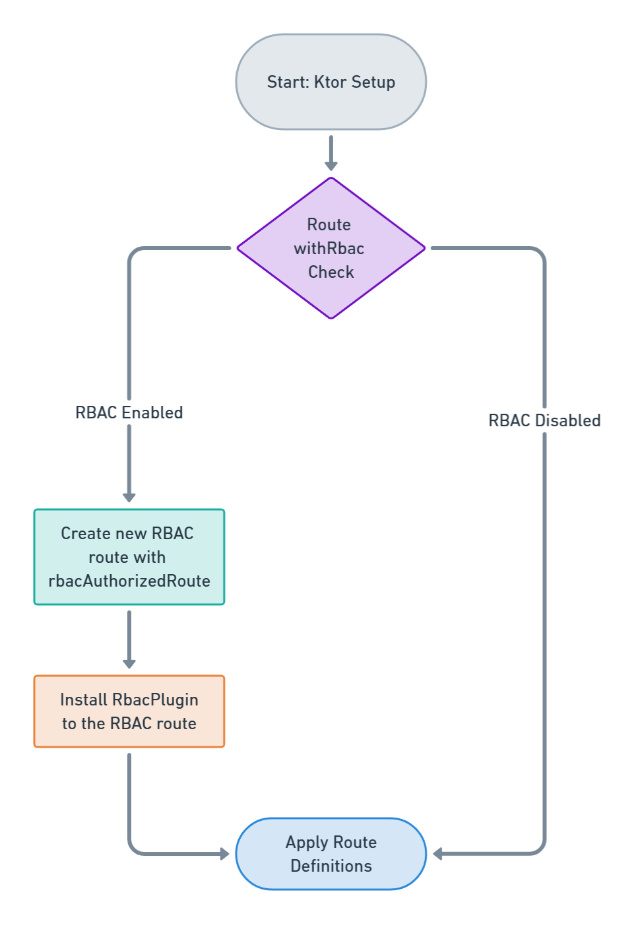
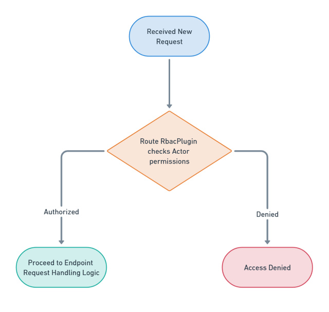

## RBAC (Role Based Access Control)

The project also includes an [RBAC](../kcrud-access/src/main/kotlin/kcrud/access/rbac) implementation, including a basic role [admin panel](../kcrud-access/src/main/kotlin/kcrud/access/rbac/view) build with HTML DSL.
[Sample actors](../kcrud-access/src/main/kotlin/kcrud/access/actor/service/DefaultActorFactory.kt) and roles are created at runtime.


### RBAC technical implementation

The RBAC (Role-Based Access Control) mechanism is implemented through a Kotlin DSL, leveraging custom extensions
and plugins to secure routes.

### withRbac Extension Function:

The [withRbac](../kcrud-access/src/main/kotlin/kcrud/access/rbac/plugin/WithRbac.kt) function is designed to apply RBAC security to Ktor routes. It takes three parameters:
an [RBAC Scope](../kcrud-base/src/main/kotlin/kcrud/base/database/schema/admin/rbac/types/RbacScope.kt), an [RBAC Access Level](../kcrud-base/src/main/kotlin/kcrud/base/database/schema/admin/rbac/types/RbacAccessLevel.kt), and a lambda function containing
the route definitions. Usage example:

```kotlin
routing {
    withRbac(scope = RbacScope.SOME_SCOPE, accessLevel = RbacAccessLevel.FULL) {
        get("/some-endpoint") {
            // endpoint logic here
        }
        // It is allowed to include more endpoints under the same scope and access level.
    }
}
```

In this context, the [withRbac](../kcrud-access/src/main/kotlin/kcrud/access/rbac/plugin/WithRbac.kt) function acts as a wrapper around routes, applying RBAC checks based on the specified
scope and access level. It ensures that only **Actors** with appropriate permissions can access the routes enclosed within its block.

### Dynamic RBAC Check Integration:

Within the **withRbac** function, there's a conditional that checks whether RBAC is enabled.
If RBAC is active, it calls **rbacAuthorizedRoute**, applying the specified RBAC settings to the routes defined in the build block.
If RBAC is not enabled, it applies the route definitions without RBAC checks, allowing unrestricted access.

### RbacAuthorizedRoute Internal Function:

The [rbacAuthorizedRoute](../kcrud-access/src/main/kotlin/kcrud/access/rbac/plugin/RbacAuthorizedRoute.kt) function is the core of the RBAC implementation. It creates a new route node marked with the required RBAC constraints,
and installs the [RbacPlugin](../kcrud-access/src/main/kotlin/kcrud/access/rbac/plugin/RbacPlugin.kt) onto the newly created route. The RbacPlugin is configured with the RBAC settings (scope and accessLevel)
provided to `rbacAuthorizedRoute`. The plugin's role is to intercept incoming requests to the route and perform RBAC checks,
ensuring that only **Actors** with the required permissions can proceed.

### RBAC Checks and Route Handling:

When a request hits an RBAC-protected route, the **RbacPlugin** evaluates the Actor's permissions against the required access level
for the associated scope. If the Actor has sufficient permissions, the request is allowed to proceed to the route's handling logic,
defined within the request build block. If the Actor lacks the necessary permissions, the request is denied.

Through this implementation, the application effectively integrates RBAC into its routing system, leveraging Ktor's extensibility
to provide a flexible and secure mechanism for controlling access to different parts of the application.

### RBAC Route Setup:



### RBAC Request Execution:



### A note about field level access control:

Field Level access control is partially implemented. Each RBAC scope rule has a [fieldRules](../kcrud-access/src/main/kotlin/kcrud/access/rbac/entity/field) map that
can be used to define which fields must be managed, for example, should be anonymized. For such, the target entity
must inherit from [BaseRbacEntity](../kcrud-access/src/main/kotlin/kcrud/access/rbac/entity/base/BaseRbacEntity.kt), and call the anonymize function accordingly based on the defined field rules,
for example, before returning the entity to a client.

